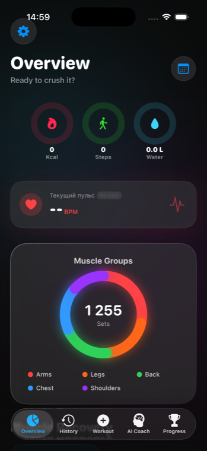
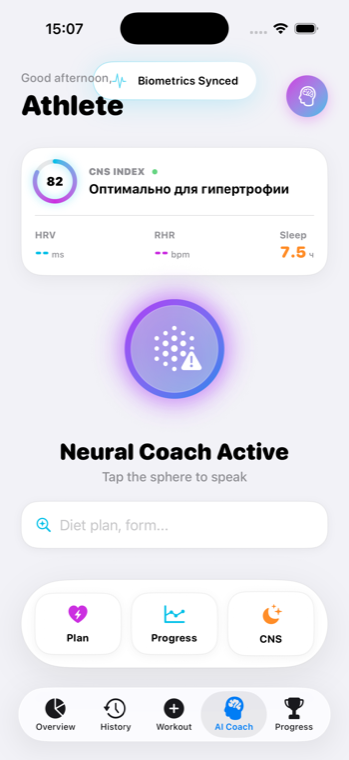
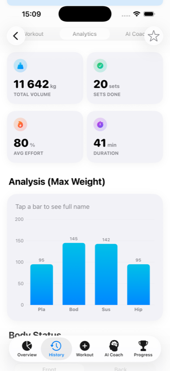
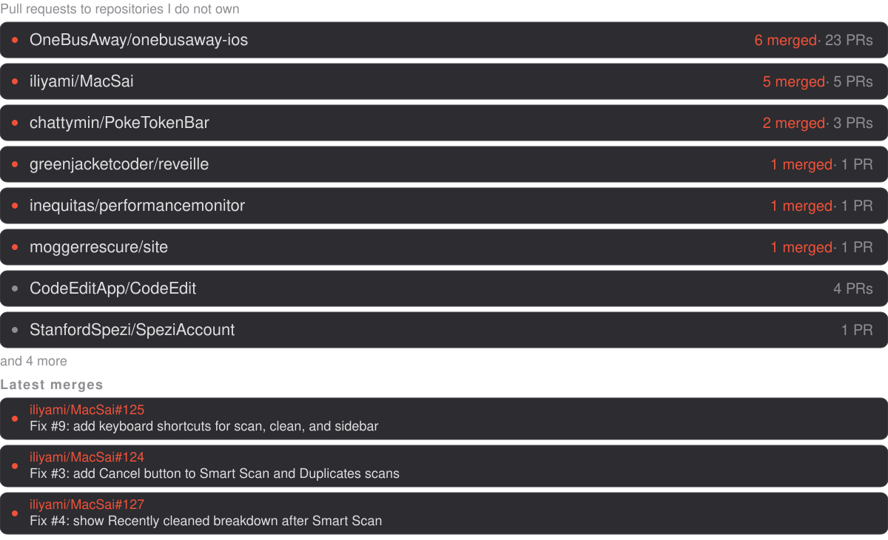
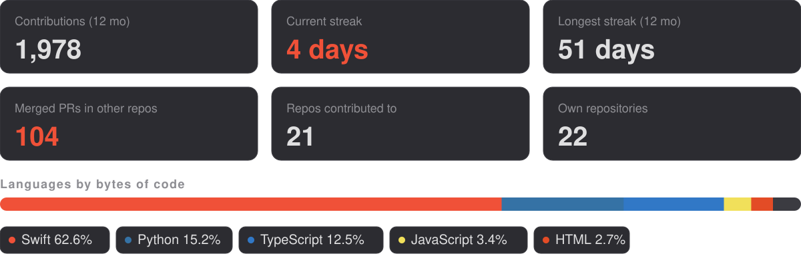

<picture>
  <source media="(prefers-color-scheme: dark)" srcset="assets/hero-dark.svg">
  <source media="(prefers-color-scheme: light)" srcset="assets/hero-light.svg">
  
</picture>

**Native iOS developer**, third-year CS student at BSUIR in Minsk. I build SwiftUI apps end to end — SwiftData, on-device Core ML and Vision, Live Activities, widgets, watchOS — and the Python services and data pipelines that sit behind them.

<picture>
  <source media="(prefers-color-scheme: dark)" srcset="assets/status-dark.svg">
  <source media="(prefers-color-scheme: light)" srcset="assets/status-light.svg">
  
</picture>

<picture>
  <source media="(prefers-color-scheme: dark)" srcset="assets/sec-apps-dark.svg">
  <source media="(prefers-color-scheme: light)" srcset="assets/sec-apps-light.svg">
  
</picture>

  
  
  

*WorkoutTracker: daily overview, on-device Neural Coach, training analytics.*

- **[WorkoutTracker](https://github.com/Borisserz/WorkoutTracker)** — training tracker with on-device form analysis via Vision and Core ML, Live Activities, home-screen widgets, a watchOS companion, and a Vertex AI coach behind Firebase App Check.
- **[FoodTracker](https://github.com/Borisserz/FoodTracker)** — nutrition app built on multimodal Gemini 2.5 Flash, computer vision and HealthKit. Shares an App Group with WorkoutTracker, so training load adjusts the day's macro targets.
- **[Yoga](https://github.com/Borisserz/Yoga)** — yoga companion with real-time pose tracking on `VNHumanBodyPoseObservation`, per-pose joint-angle analysis, spoken feedback and a Firestore leaderboard.
- **[Stepper](https://github.com/Borisserz/Stepper)** — pedometer and route tracker on MapKit and Core Location. Work in progress, UI-first.
- **[prototip](https://github.com/Borisserz/prototip)** — multi-tenant BI platform where a plain-language question becomes SQL, charts and a report. LangGraph orchestrator, ClickHouse warehouse with a vector store for RAG, React front end.

<picture>
  <source media="(prefers-color-scheme: dark)" srcset="assets/sec-open-source-dark.svg">
  <source media="(prefers-color-scheme: light)" srcset="assets/sec-open-source-light.svg">
  
</picture>

<picture>
  <source media="(prefers-color-scheme: dark)" srcset="assets/oss-dark.svg">
  <source media="(prefers-color-scheme: light)" srcset="assets/oss-light.svg">
  
</picture>

Merged elsewhere:

- [OneBusAway/onebusaway-ios#1220](https://github.com/OneBusAway/onebusaway-ios/pull/1220) — numeric-aware sorting for route filters, so `Route 2` no longer lands after `Route 10`.
- [greenjacketcoder/reveille#6](https://github.com/greenjacketcoder/reveille/pull/6) — meeting-provider detection extended to Webex, GoToMeeting and Jitsi.
- [inequitas/performancemonitor#7](https://github.com/inequitas/performancemonitor/pull/7) — keyboard-accessible drag reordering in Settings.

Open pull requests sit with [StanfordSpezi/SpeziAccount](https://github.com/StanfordSpezi/SpeziAccount/pulls?q=author%3ABorisserz), [StanfordSpezi/SpeziFirebase](https://github.com/StanfordSpezi/SpeziFirebase/pulls?q=author%3ABorisserz) and [brightdigit/CelestraKit](https://github.com/brightdigit/CelestraKit/pulls?q=author%3ABorisserz).

<picture>
  <source media="(prefers-color-scheme: dark)" srcset="assets/sec-activity-dark.svg">
  <source media="(prefers-color-scheme: light)" srcset="assets/sec-activity-light.svg">
  
</picture>

<picture>
  <source media="(prefers-color-scheme: dark)" srcset="assets/activity-dark.svg">
  <source media="(prefers-color-scheme: light)" srcset="assets/activity-light.svg">
  
</picture>

<picture>
  <source media="(prefers-color-scheme: dark)" srcset="https://raw.githubusercontent.com/Borisserz/Borisserz/output/github-snake-dark.svg">
  <source media="(prefers-color-scheme: light)" srcset="https://raw.githubusercontent.com/Borisserz/Borisserz/output/github-snake-light.svg">
  
</picture>

<picture>
  <source media="(prefers-color-scheme: dark)" srcset="assets/sec-stack-dark.svg">
  <source media="(prefers-color-scheme: light)" srcset="assets/sec-stack-light.svg">
  
</picture>

<picture>
  <source media="(prefers-color-scheme: dark)" srcset="assets/stack-dark.svg">
  <source media="(prefers-color-scheme: light)" srcset="assets/stack-light.svg">
  
</picture>

<picture>
  <source media="(prefers-color-scheme: dark)" srcset="assets/sec-contact-dark.svg">
  <source media="(prefers-color-scheme: light)" srcset="assets/sec-contact-light.svg">
  
</picture>

<a href="https://t.me/borisserz"><picture>
  <source media="(prefers-color-scheme: dark)" srcset="assets/badge-telegram-dark.svg">
  <source media="(prefers-color-scheme: light)" srcset="assets/badge-telegram-light.svg">
  
</picture></a>
<a href="https://www.linkedin.com/in/boris-serzhanovich-87b95b296"><picture>
  <source media="(prefers-color-scheme: dark)" srcset="assets/badge-linkedin-dark.svg">
  <source media="(prefers-color-scheme: light)" srcset="assets/badge-linkedin-light.svg">
  
</picture></a>

The activity and open-source cards above are regenerated daily by a GitHub Action straight from the GitHub API, so nothing on this page depends on a third-party badge service staying online.
