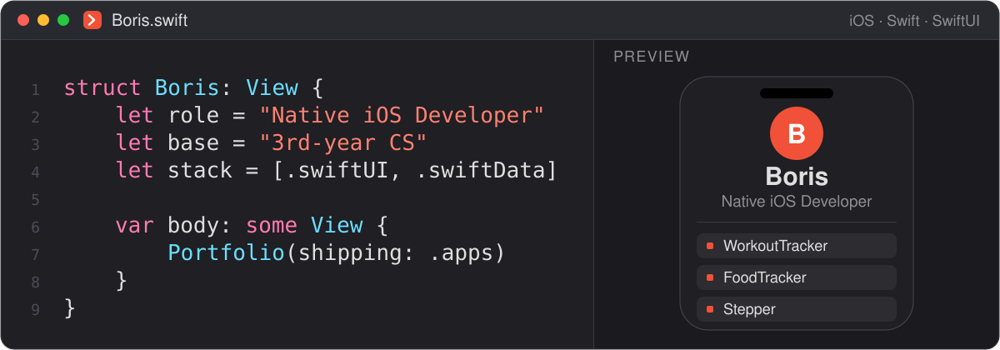
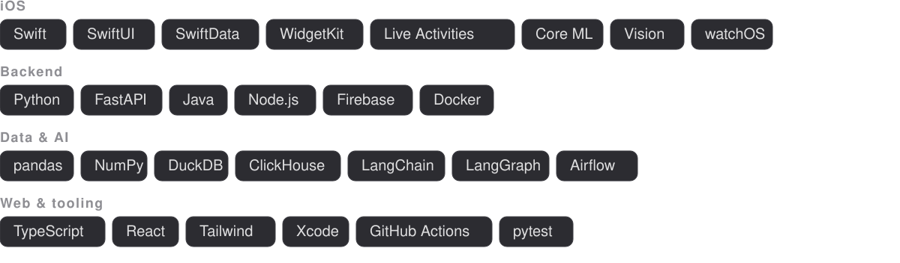
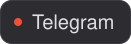
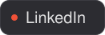
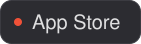

<picture>
  <source media="(prefers-color-scheme: dark)" srcset="assets/hero-dark.svg">
  <source media="(prefers-color-scheme: light)" srcset="assets/hero-light.svg">
  
</picture>

**Native iOS developer**, third-year CS student at BSUIR in Minsk. I build SwiftUI apps end to end — SwiftData, on-device Core ML and Vision, Live Activities, widgets, watchOS — and the Python services and data pipelines that sit behind them.

<picture>
  <source media="(prefers-color-scheme: dark)" srcset="assets/status-dark.svg">
  <source media="(prefers-color-scheme: light)" srcset="assets/status-light.svg">
  
</picture>

<picture>
  <source media="(prefers-color-scheme: dark)" srcset="assets/sec-activity-dark.svg">
  <source media="(prefers-color-scheme: light)" srcset="assets/sec-activity-light.svg">
  
</picture>

<picture>
  <source media="(prefers-color-scheme: dark)" srcset="assets/activity-dark.svg?v=202608060906">
  <source media="(prefers-color-scheme: light)" srcset="assets/activity-light.svg?v=202608060906">
  
</picture>

<picture>
  <source media="(prefers-color-scheme: dark)" srcset="https://raw.githubusercontent.com/Borisserz/Borisserz/output/github-snake-dark.svg">
  <source media="(prefers-color-scheme: light)" srcset="https://raw.githubusercontent.com/Borisserz/Borisserz/output/github-snake-light.svg">
  
</picture>

<picture>
  <source media="(prefers-color-scheme: dark)" srcset="assets/sec-apps-dark.svg">
  <source media="(prefers-color-scheme: light)" srcset="assets/sec-apps-light.svg">
  
</picture>

- **[WorkoutTracker](https://github.com/Borisserz/WorkoutTracker)** ([App Store](https://apps.apple.com/us/app/ai-workout-coach-gym-tracker/id6774895106)) — training tracker with on-device form analysis via Vision and Core ML, Live Activities, home-screen widgets, a watchOS companion, and a Vertex AI coach behind Firebase App Check.
- **[FoodTracker](https://github.com/Borisserz/FoodTracker)** ([App Store](https://apps.apple.com/us/app/foodtracker-ai-macro-tracker/id6778506345)) — nutrition app built on multimodal Gemini 2.5 Flash, computer vision and HealthKit. Shares an App Group with WorkoutTracker, so training load adjusts the day's macro targets.
- **[Yoga](https://github.com/Borisserz/Yoga)** — yoga companion with real-time pose tracking on `VNHumanBodyPoseObservation`, per-pose joint-angle analysis, spoken feedback and a Firestore leaderboard.
- **[Stepper](https://github.com/Borisserz/Stepper)** — pedometer and route tracker on MapKit and Core Location. Work in progress, UI-first.
- **[FitRPG](https://github.com/Borisserz/rpg-fitness)** (fork of [moggerrescure/rpg-fitness](https://github.com/moggerrescure/rpg-fitness)) — fitness RPG: on-device camera rep tracking powers Arena PvP, clans, raids and quest islands. SwiftUI, HealthKit, Firebase. Free, no IAP.

<picture>
  <source media="(prefers-color-scheme: dark)" srcset="assets/sec-open-source-dark.svg">
  <source media="(prefers-color-scheme: light)" srcset="assets/sec-open-source-light.svg">
  
</picture>

<picture>
  <source media="(prefers-color-scheme: dark)" srcset="assets/oss-dark.svg?v=202608060906">
  <source media="(prefers-color-scheme: light)" srcset="assets/oss-light.svg?v=202608060906">
  
</picture>

<picture>
  <source media="(prefers-color-scheme: dark)" srcset="assets/sec-stack-dark.svg">
  <source media="(prefers-color-scheme: light)" srcset="assets/sec-stack-light.svg">
  
</picture>

<picture>
  <source media="(prefers-color-scheme: dark)" srcset="assets/stack-dark.svg">
  <source media="(prefers-color-scheme: light)" srcset="assets/stack-light.svg">
  
</picture>

<picture>
  <source media="(prefers-color-scheme: dark)" srcset="assets/sec-contact-dark.svg">
  <source media="(prefers-color-scheme: light)" srcset="assets/sec-contact-light.svg">
  
</picture>

The activity and open-source cards above are regenerated every few hours by a GitHub Action straight from the GitHub API, so nothing on this page depends on a third-party badge service staying online.
